# Порождающие шаблоны (Creational Patterns)

## 1 Singleton

### Описание:

В Android для хранения небольших, но важных для приложения данных используется dataStore. Он позволяет
хранить данные локально и удобно их получать.

### Реализация:

```
// Singleton для управления доступом к DataStore
object UserDataStore {
    private lateinit var dataStore: DataStore<User>

    fun initialize(context: Context) {
        dataStore = context.userDataStore
    }

    val userFlow: Flow<User>
        get() = dataStore.data

    suspend fun updateUser(newUser: User) {
        dataStore.updateData { currentUser ->
            newUser
        }
    }
}

suspend fun updateUserExample(context: Context) {
    UserDataStore.initialize(context)
    UserDataStore.updateUser(User(name = "John Doe", age = 30))

    UserDataStore.userFlow.map { user ->
        println("User: ${user.name}, Age: ${user.age}")
    }
}
```

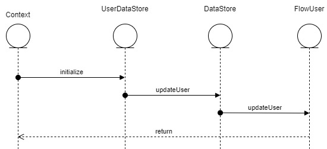

## 2 Prototype

### Пояснение:

В Android приложении я использую userFlow. Который позволяет иметь 1 пользователя находящегося в Flow. Можно сделать Observer, который будет следить за определенным свойством пользователя в userFlow, после изменения user, будет изменён UI.
Prototype заключается в том-что получая user из userFlow мы получаем копию, которую изменяем и потом добавляет в userFlow.

### Реализация:

```
class UserViewModel : ViewModel() {
    //Позволяет менять данные
    private val _user = MutableLiveData<User>().apply { value = User() }

    // Предоставляет только доступ к чтению
    val user: LiveData<User> get() = _user
    fun updateUser(newUser: User) {
        _user.value = newUser
    }

    fun getUser(): User {
        return _user.value.copy() ?: throw IllegalStateException("getUser, User is null")
    }
}
```

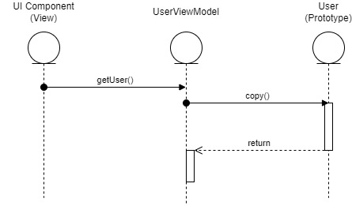

## 3 Builder

### Реализация:

```
data class User(
    val userId: String,
    val curRepeatDays: Int,
    val maxRepeatDays: Int,
    val countFullLearnedWords: Int,
    val countLearningWords: Int,
    val countLearnedWordsToday: Int,
    val checkLearnedAllWordsToday: Boolean,
    val countKnewWords: Int,
    val listOfLevels: MutableList<Levels>,
    val checkBritishVariables: Boolean,
    val lastTimeLearnedWords: Instant,
    val hashMapOfWordsForRepeatAndLevelsNames: HashMap<Words, String>,
    val countRepeatedWordsToday: Int
) {
    // Вложенный класс Builder
    class Builder {
        private var userId: String = ""
        private var curRepeatDays: Int = 0
        private var maxRepeatDays: Int = 0
        private var countFullLearnedWords: Int = 0
        private var countLearningWords: Int = 0
        private var countLearnedWordsToday: Int = 0
        private var checkLearnedAllWordsToday: Boolean = false
        private var countKnewWords: Int = 0
        private var listOfLevels: MutableList<Levels> = mutableListOf()
        private var checkBritishVariables: Boolean = false
        private var lastTimeLearnedWords: Instant = Instant.now()
        private var hashMapOfWordsForRepeatAndLevelsNames: HashMap<Words, String> = hashMapOf()
        private var countRepeatedWordsToday: Int = 0

        fun setUserId(userId: String) = apply { this.userId = userId }
        fun setCurRepeatDays(curRepeatDays: Int) = apply { this.curRepeatDays = curRepeatDays }
        fun setMaxRepeatDays(maxRepeatDays: Int) = apply { this.maxRepeatDays = maxRepeatDays }
        fun setCountFullLearnedWords(countFullLearnedWords: Int) = apply { this.countFullLearnedWords = countFullLearnedWords }
        fun setCountLearningWords(countLearningWords: Int) = apply { this.countLearningWords = countLearningWords }
        fun setCountLearnedWordsToday(countLearnedWordsToday: Int) = apply { this.countLearnedWordsToday = countLearnedWordsToday }
        fun setCheckLearnedAllWordsToday(checkLearnedAllWordsToday: Boolean) = apply { this.checkLearnedAllWordsToday = checkLearnedAllWordsToday }
        fun setCountKnewWords(countKnewWords: Int) = apply { this.countKnewWords = countKnewWords }
        fun setListOfLevels(listOfLevels: MutableList<Levels>) = apply { this.listOfLevels = listOfLevels }
        fun setCheckBritishVariables(checkBritishVariables: Boolean) = apply { this.checkBritishVariables = checkBritishVariables }
        fun setLastTimeLearnedWords(lastTimeLearnedWords: Instant) = apply { this.lastTimeLearnedWords = lastTimeLearnedWords }
        fun setHashMapOfWordsForRepeatAndLevelsNames(hashMapOfWordsForRepeatAndLevelsNames: HashMap<Words, String>) = apply { this.hashMapOfWordsForRepeatAndLevelsNames = hashMapOfWordsForRepeatAndLevelsNames }
        fun setCountRepeatedWordsToday(countRepeatedWordsToday: Int) = apply { this.countRepeatedWordsToday = countRepeatedWordsToday }

        fun build(): User {
            return User(
                userId = userId,
                curRepeatDays = curRepeatDays,
                maxRepeatDays = maxRepeatDays,
                countFullLearnedWords = countFullLearnedWords,
                countLearningWords = countLearningWords,
                countLearnedWordsToday = countLearnedWordsToday,
                checkLearnedAllWordsToday = checkLearnedAllWordsToday,
                countKnewWords = countKnewWords,
                listOfLevels = listOfLevels,
                checkBritishVariables = checkBritishVariables,
                lastTimeLearnedWords = lastTimeLearnedWords,
                hashMapOfWordsForRepeatAndLevelsNames = hashMapOfWordsForRepeatAndLevelsNames,
                countRepeatedWordsToday = countRepeatedWordsToday
            )
        }
    }
}

val user = User.Builder()
    .setUserId("12345")
    .setCurRepeatDays(10)
    .setMaxRepeatDays(15)
    .setCountFullLearnedWords(100)
    .setCountLearningWords(50)
    .setCountLearnedWordsToday(5)
    .setCheckLearnedAllWordsToday(true)
    .setCountKnewWords(200)
    .setListOfLevels(mutableListOf())
    .setCheckBritishVariables(true)
    .setLastTimeLearnedWords(Instant.now())
    .setHashMapOfWordsForRepeatAndLevelsNames(hashMapOf())
    .setCountRepeatedWordsToday(3)
    .build()
```

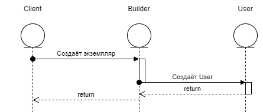

# Структурные шаблоны (Structural Patterns):

## 1 Facade:

### Пояснение:

В Android приложении есть база данных SQLite. Взаимодействие происходит через интерфейс WordsDAO.

```
interface WordsDAO {
    //Upsert объединение insert и update
    //Добавляем слово
    @Upsert
    suspend fun insertWord(word: Words): Long

    //Добавляем уровень английского
    @Upsert
    suspend fun insertLevel(level: Levels)

    //Добавляем значения в junction table
    @Upsert
    suspend fun insertWordsLevel(wordsLevel: WordsLevels)
    ...
}
```

Шаблон Facade реализуется в том что мы получаем доступ ко всем функциям взаимодействия с Базой данных через один интерфейс

```
val db = MainDB.getDB(thisContext)
db.getDao().updateWordLevelsStage(word.id, stageChanged, dateLearn)
```

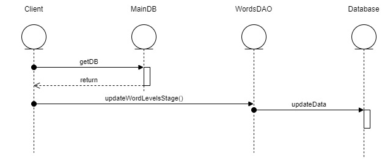

## 2 Bridge

### Пояснение:

Для реализации рендернинга элементов в светлой и тёмной теме используется Bridge

### Реализация:

```
interface ThemeRenderer {
    @Composable
    fun RenderBackground()

    @Composable
    fun RenderLearnWordsButton(onClick: () -> Unit)
}
```

Класс для светлой темы

```
class LightThemeRenderer : ThemeRenderer {
    @Composable
    override fun RenderBackground() {
        Box(modifier = Modifier.fillMaxSize().background(Color.White))
    }

    @Composable
    override fun RenderLearnWordsButton(onClick: () -> Unit) {
        Button(
            onClick = onClick,
            colors = ButtonDefaults.buttonColors(backgroundColor = Color.Blue)
        ) {
            Text("Learn Words", color = Color.White)
        }
    }
}
```

Класс для тёмной темы

```
class DarkThemeRenderer : ThemeRenderer {
    @Composable
    override fun RenderBackground() {
        Box(modifier = Modifier.fillMaxSize().background(Color.Black))
    }

    @Composable
    override fun RenderLearnWordsButton(onClick: () -> Unit) {
        Button(
            onClick = onClick,
            colors = ButtonDefaults.buttonColors(backgroundColor = Color.DarkGray)
        ) {
            Text("Learn Words", color = Color.White)
        }
    }
}
```

абстрактный UI элемент

```
abstract class UIElement(protected val renderer: ThemeRenderer) {
    @Composable
    abstract fun Render()
}
```

Конкретные элементы

```
class Background(renderer: ThemeRenderer) : UIElement(renderer) {
    @Composable
    override fun Render() {
        renderer.RenderBackground()
    }
}

class LearnWordsButton(renderer: ThemeRenderer, private val onClick: () -> Unit) : UIElement(renderer) {
    @Composable
    override fun Render() {
        renderer.RenderLearnWordsButton(onClick)
    }
}
```

Реализация

```
@Composable
//Проверяем включана ли тёмная тема, в зависимости от этого создаем ThemerRender.
fun MainScreen(isDarkMode: Boolean) {
    val themeRenderer: ThemeRenderer = if (isDarkMode) DarkThemeRenderer() else LightThemeRenderer()

    //Рендерим фон и кнопки
    val background = Background(themeRenderer)
    val learnWordsButton = LearnWordsButton(themeRenderer) {}

    background.Render()

    Column(
        modifier = Modifier.fillMaxSize(),
        verticalArrangement = Arrangement.Center,
        horizontalAlignment = Alignment.CenterHorizontally
    ) {
        learnWordsButton.Render()
        Spacer(modifier = Modifier.height(16.dp))
    }
}
```

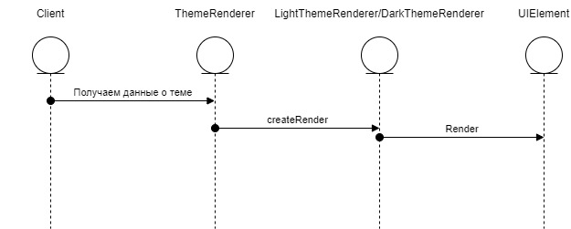

## 3 Adapter

### Пояснение

Для того чтобы преобразовывать для отправки данные по api можно использовать Adapter и конвертировать мой class Words в Json.

### Реализация:

```
import org.json.JSONObject

// Модель данных приложения
data class Word(val text: String, val meaning: String)

// Адаптер для преобразования Word в JSON
class WordToJsonAdapter(private val word: Word) {
    fun toJson(): String {
        val jsonObject = JSONObject()
        jsonObject.put("text", word.text)
        jsonObject.put("meaning", word.meaning)
        return jsonObject.toString()
    }
}

// Пример использования
fun main() {
    val word = Word(text = "hello", meaning = "привет")
    val adapter = WordToJsonAdapter(word)

    val json = adapter.toJson()
    println(json)  // Output: {"text":"hello","meaning":"привет"}
}
```

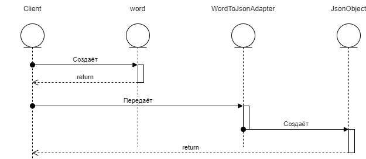

## 4 Decorator

### Пояснение

Интерфейс Word: Определяет метод display, который реализуют все слова.
Класс BasicWord: Базовый объект слова.
Класс WordDecorator: Базовый декоратор, который реализует интерфейс Word и принимает другой объект Word, оборачивая его.
ViewedWordDecorator: Декоратор, добавляющий функциональность "слово просмотрено".
LearnedWordDecorator: Декоратор, добавляющий функциональность "слово изучено".
Использование: Слово сначала декорируется для добавления статуса "просмотрено", затем повторно декорируется для добавления статуса "изучено".

### Реализация

```
// Базовый интерфейс
interface Word {
    fun display(): String
}

// Конкретная реализация Word
class BasicWord(private val text: String, private val meaning: String) : Word {
    override fun display(): String {
        return "Word: $text, Meaning: $meaning"
    }
}

// Базовый декоратор
abstract class WordDecorator(protected val decoratedWord: Word) : Word {
    override fun display(): String {
        return decoratedWord.display()
    }
}

// Декоратор для добавления функциональности "просмотрено"
class ViewedWordDecorator(decoratedWord: Word) : WordDecorator(decoratedWord) {
    override fun display(): String {
        return "${super.display()} [Viewed]"
    }
}

// Декоратор для добавления функциональности "изучено"
class LearnedWordDecorator(decoratedWord: Word) : WordDecorator(decoratedWord) {
    override fun display(): String {
        return "${super.display()} [Learned]"
    }
}

// Пример использования
fun main() {
    val word = BasicWord("hello", "привет")
    println(word.display()) // Output: Word: hello, Meaning: привет

    // Добавляем "просмотрено"
    val viewedWord = ViewedWordDecorator(word)
    println(viewedWord.display()) // Output: Word: hello, Meaning: привет [Viewed]

    // Добавляем "изучено"
    val learnedAndViewedWord = LearnedWordDecorator(viewedWord)
    println(learnedAndViewedWord.display()) // Output: Word: hello, Meaning: привет [Viewed] [Learned]
}
```

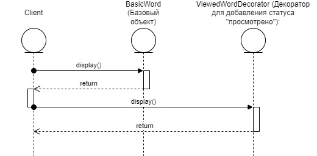

# Поведенчиские шаблоны

## 1 Observer (Наблюдатель):

### Пояснение:

Для изменения UI элементов, когда происходит изменения данных пользователя я использовал Observer

### Реализация:

```
//Добавляем кол-во слов для повторения
userViewModel.user.observe(viewLifecycleOwner) { userObserve ->
    binding.mainSmallTextRepeatWords.text =
        "Слова для повтора: ${userObserve.hashMapOfWordsForRepeatAndLevelsNames.size}"
}

userViewModel.user.observe(viewLifecycleOwner) { userObserve ->
    binding.mainSmallTextTodayLearned.text =
        "Выучено сегодня новых слов: ${userObserve.countLearnedWordsToday}"
}
```

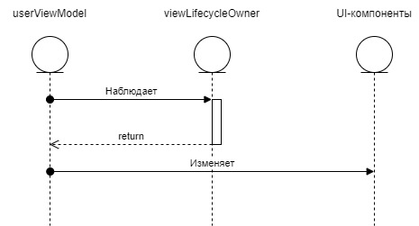

## 2 Command

### Пояснение:

В приложении на главной страницы есть несколько кнопок: Учить новые слова, повторить слова, повторить все слова.
Для их реализации используется паттерн Command

### Реализация:

```
// Интерфейс команды
interface Command {
    fun execute()
}

// Команда для кнопки "Учить слова"
class LearnWordsCommand(private val receiver: WordsReceiver) : Command {
    override fun execute() {
        receiver.learnWords()
    }
}

// Команда для кнопки "Повторить слова"
class ReviewWordsCommand(private val receiver: WordsReceiver) : Command {
    override fun execute() {
        receiver.reviewWords()
    }
}
// Команда для кнопки "Завершить"
class FinishCommand(private val receiver: WordsReceiver) : Command {
    override fun execute() {
        receiver.finish()
    }
}

// Получатель команды
class WordsReceiver {
    fun learnWords() {
        (requireActivity() as MainActivity).loadFragment(FragmentsNames.LEARN_WORDS)
    }

    fun reviewWords() {
        (requireActivity() as MainActivity).loadFragment(FragmentsNames.REPEAT_WORDS)
    }

    fun finish() {
        (requireActivity() as MainActivity).loadFragment(FragmentsNames.REPEAT_WORDS_ALL_WORDS)
    }
}
```

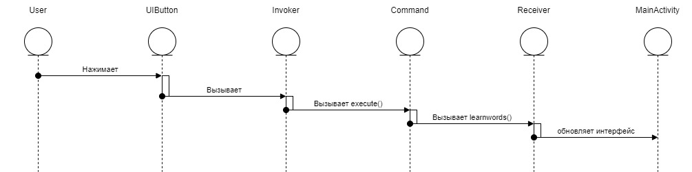

## 3 Strategy:

### Пояснение:

Позволяет определить семейство алгоритмов, инкапсулировать их и делать взаимозаменяемыми. Легче реализовать разные методы изучения слов: метод карточек, метод написания, метод повторения. Можно создать интерфейс для стратегии обучения и реализовать несколько конкретных стратегий. При изменении потребностей пользователя стратегия легко меняется.

### Реализация:

```
// Интерфейс стратегии
interface LearningStrategy {
    fun learn(word: String)
}

// Конкретная стратегия: Метод карточек
class FlashcardLearningStrategy : LearningStrategy {
    override fun learn(word: String) {
        println("Учите слово '$word' с помощью карточек.")
    }
}

// Конкретная стратегия: Метод написания
class WritingLearningStrategy : LearningStrategy {
    override fun learn(word: String) {
        println("Учите слово '$word', записывая его.")
    }
}

// Контекст, использующий стратегию
class LearningContext(private var strategy: LearningStrategy) {
    fun setStrategy(newStrategy: LearningStrategy) {
        strategy = newStrategy
    }

    fun learnWord(word: String) {
        strategy.learn(word)
    }
}

// Пример использования
fun main() {
    val context = LearningContext(FlashcardLearningStrategy())
    context.learnWord("hello")

    context.setStrategy(WritingLearningStrategy())
    context.learnWord("world")
}
```

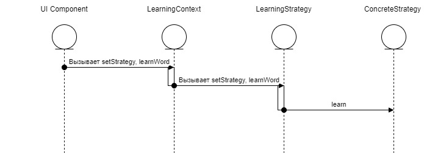

## 4 State

### Пояснение:

Позволяет объекту изменять свое поведение при изменении его внутреннего состояния. Это полезно для управления режимами работы приложения.Можно реализовать состояния приложения, например "Учебный режим", "Режим повтора" и "Режим завершения". Каждое состояние будет определять, какие действия доступны и как ведет себя интерфейс пользователя.

### Реализация

```
// Интерфейс состояния
interface AppState {
    fun onEnterState()
    fun onAction()
}

// Конкретное состояние: Учебный режим
class LearningState(private val context: AppContext) : AppState {
    override fun onEnterState() {
        println("Вход в режим 'Учеба'.")
    }

    override fun onAction() {
        println("Учим новые слова.")
    }
}

// Конкретное состояние: Режим повтора
class ReviewingState(private val context: AppContext) : AppState {
    override fun onEnterState() {
        println("Вход в режим 'Повторение'.")
    }

    override fun onAction() {
        println("Повторяем изученные слова.")
    }
}

// Конкретное состояние: Завершение
class CompletedState(private val context: AppContext) : AppState {
    override fun onEnterState() {
        println("Вход в режим 'Завершение'.")
    }

    override fun onAction() {
        println("Обучение завершено.")
    }
}

// Контекст, управляющий состояниями
class AppContext {
    private var state: AppState? = null

    fun setState(newState: AppState) {
        state = newState
        state?.onEnterState()
    }

    fun performAction() {
        state?.onAction()
    }
}

// Пример использования
fun main() {
    val context = AppContext()

    context.setState(LearningState(context))
    context.performAction()

    context.setState(ReviewingState(context))
    context.performAction()

    context.setState(CompletedState(context))
    context.performAction()
}
```

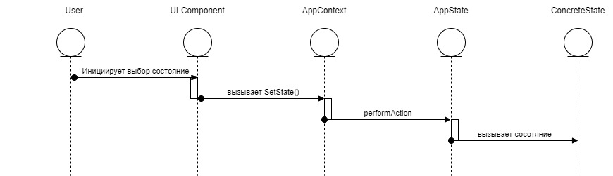

## Mediator

### Пояснение:

Обеспечивает централизованное управление взаимодействиями между различными объектами. Это снижает связанность между ними.
Можно использовать для управление взаимодействиями между несколькими элементами пользовательского интерфейса. Например, изменение текстового поля может автоматически обновлять список слов, а также кнопки обучения и повтора через посредника.

### Реализация:

```
// Интерфейс посредника
interface Mediator {
    fun notify(sender: Any, event: String)
}

// Конкретный посредник
class LearningMediator(
    private val textField: TextFieldComponent,
    private val button: ButtonComponent,
    private val listView: ListViewComponent
) : Mediator {

    textField.setMediator(this)
    button.setMediator(this)
    listView.setMediator(this)

    override fun notify(sender: Any, event: String) {
        when (event) {
            "TextChanged" -> {
                println("Обновляем список слов на основе текста: ${textField.getText()}.")
                listView.update(textField.getText())
            }
            "ButtonClicked" -> {
                println("Кнопка нажата. Обновляем все компоненты.")
                textField.clear()
                listView.refresh()
            }
        }
    }
}

// Компоненты
abstract class Component(protected var mediator: Mediator? = null) {
    fun setMediator(mediator: Mediator) {
        this.mediator = mediator
    }
}

class TextFieldComponent : Component() {
    private var text: String = ""

    fun setText(newText: String) {
        text = newText
        mediator?.notify(this, "TextChanged")
    }

    fun getText(): String = text

    fun clear() {
        text = ""
        println("Текстовое поле очищено.")
    }
}

class ButtonComponent : Component() {
    fun click() {
        mediator?.notify(this, "ButtonClicked")
    }
}

class ListViewComponent : Component() {
    fun update(filter: String) {
        println("Обновляем список на основе фильтра: $filter.")
    }

    fun refresh() {
        println("Список обновлен.")
    }
}

// Пример использования
fun main() {
    val textField = TextFieldComponent()
    val button = ButtonComponent()
    val listView = ListViewComponent()

    val mediator = LearningMediator(textField, button, listView)

    textField.setText("hello")
    button.click()
}
```

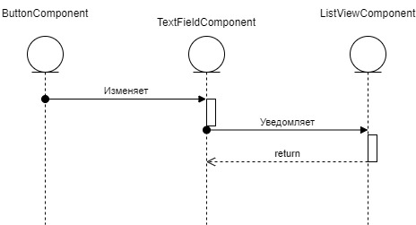
